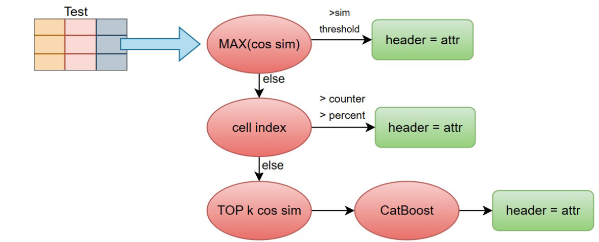

# SOTABv2 SemTab 2023 - CTA Pipeline

This repository contains the complete pipeline for **Column Type Annotation (CTA)** on the **SOTABv2 SemTab 2023** dataset.



The paper can be found: will released soon

---

# Prerequisites

- Python **3.12**
- Ollama **0.18.1**

---

# 1. Install Ollama

Install the required Ollama version:

```bash
curl -fsSL https://ollama.com/install.sh | OLLAMA_VERSION=0.18.1 sh
```

Download the embedding models used by the pipeline:

```bash
ollama pull nomic-embed-text-v2-moe:latest
ollama pull snowflake-arctic-embed2:568m
```

---

# 2. Create a Python Environment

Create and activate a virtual environment:

```bash
python3.12 -m venv venv
source venv/bin/activate
```

Install the required packages:

```bash
pip install -r requirements.txt
```

---

# 3. Dataset Structure

The dataset is expected to have the following directory structure:

```text
SOTABV2forSemTab2023/
├── CTA-SCH-R1/
│   ├── gt/
│   │   ├── supplementary_files/
│   │   ├── train.csv
│   │   ├── test.csv
│   │   └── validation.csv
│   ├── Round1-SOTAB-CTA-SCH-Tables/
│   └── supplementary_files/
├── CTA-SCH-R2/
│   └── ...
└── CTA-SCH-R3/
    └── ...
```

---

# 4. Configuration

The pipeline configuration is defined in:

```text
functions.py
```

Specifically, edit the `get_config()` function.

Each configuration option includes comments explaining its purpose.

## First Run

For the **first execution**, set the following flags to **False** so the pipeline generates all required intermediate files:

- `PREPROCESS_EMB_FILES_EXISTS`
- `MODEL_EXISTS`
- `PROTOTYPES_EMB_EXISTS`
- `CELL_DICT_EXISTS`

After these files have been generated, you may set the corresponding flags to **True** to skip recomputation and significantly reduce execution time.

---

# 5. Running the Pipeline

Execute the full pipeline with:

```bash
python -u cta_full_pipeline.py 2>&1 | tee pipeline.log
```

All console output will be redirected to:

```text
pipeline.log
```

allowing you to monitor progress and inspect any errors after execution.

---

# Pipeline Workflow

1. Install Ollama.
2. Download the required embedding models.
3. Create and activate the Python virtual environment.
4. Install the project dependencies.
5. Place the dataset in the expected directory structure.
6. Configure `get_config()` in `functions.py`.
7. Run the pipeline.
8. Check `pipeline.log` for progress and debugging information.

---

# Notes

- The first run performs preprocessing and embedding generation, which may take a considerable amount of time.
- Subsequent runs can be accelerated by enabling the corresponding `*_EXISTS` configuration flags after the required files have been generated.

## License

Licensed under the Apache 2.0 License.
